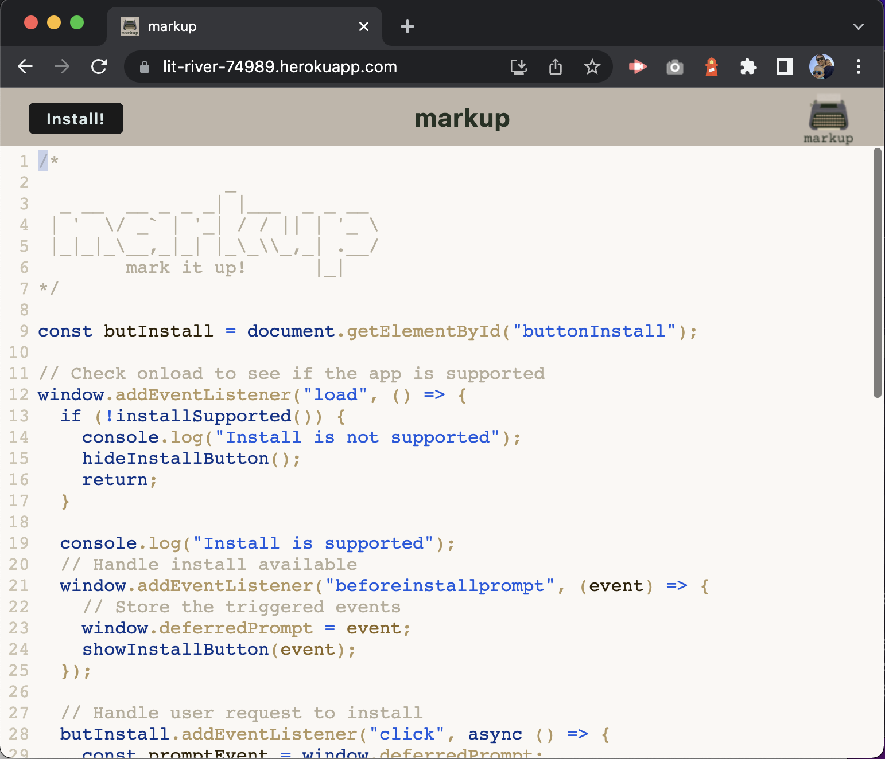
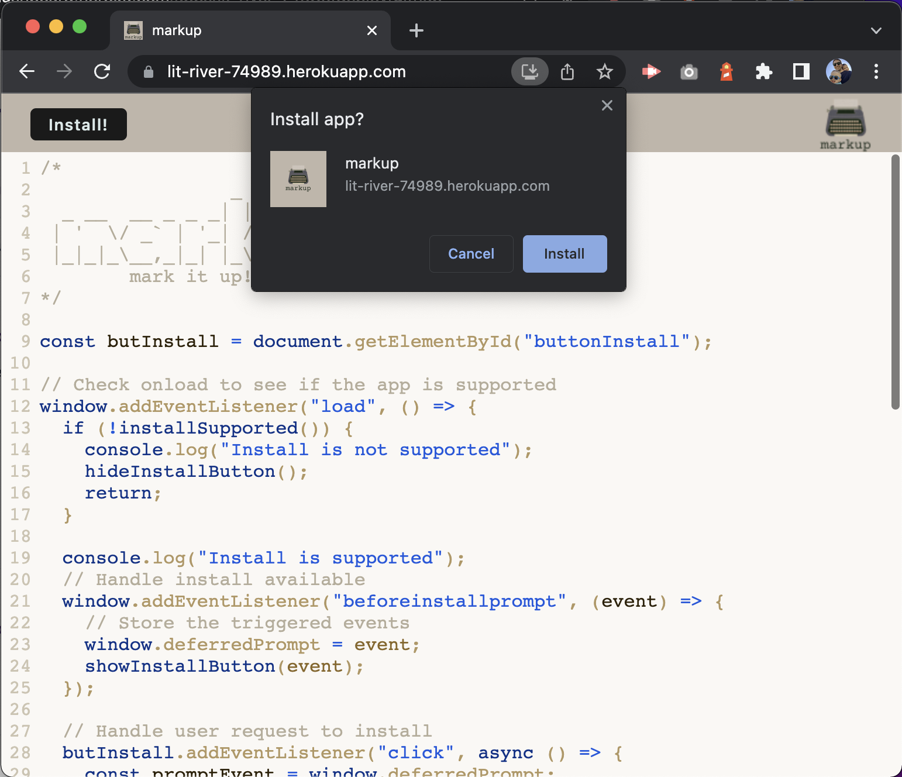
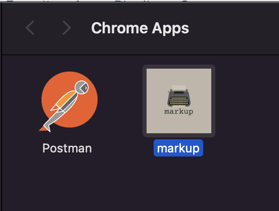
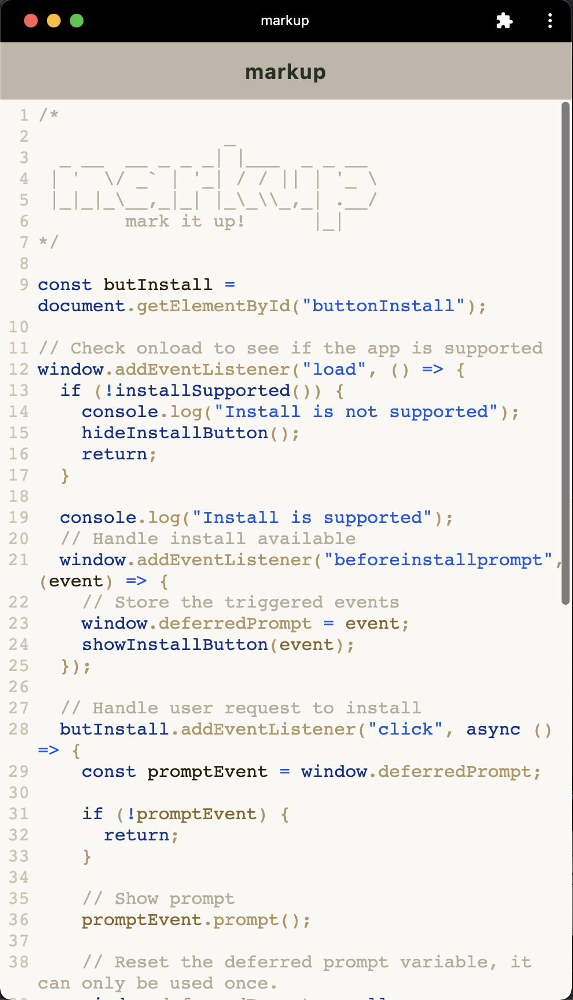
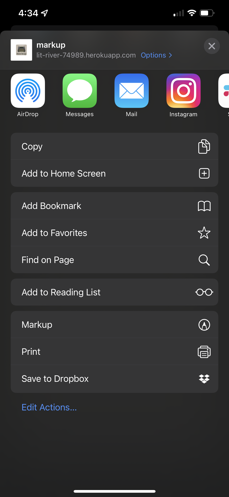
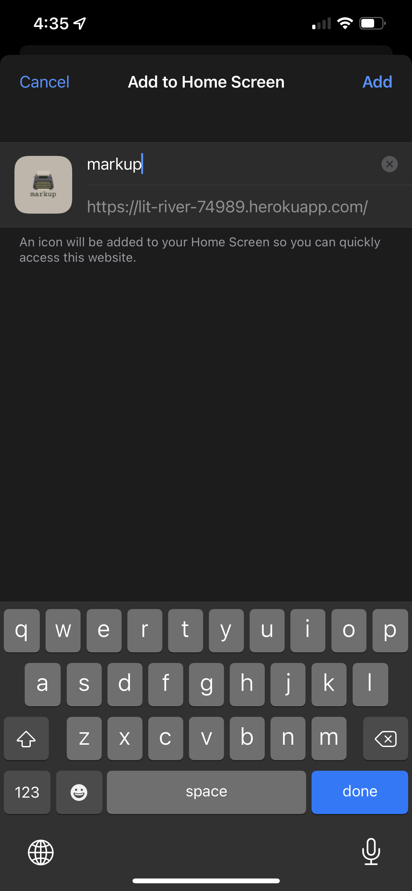

# 📝 markup

markup is a progressive web app (PWA) text editor for jotting down notes.

View the app deployed to heroku [here](https://lit-river-74989.herokuapp.com/)

## Description

This app is built with webpack to take advantage of ES6 syntax transpiling and static file combination/minification. It uses a service worker js file to control resource caching and is installable as a PWA.

## Prerequisites

- NodeJS

## Libraries

- [idb](https://www.npmjs.com/package/idb) - IndexedDB interactions
- [CodeMirror](https://codemirror.net/) - text editor display and syntax highlighting
- [workbox](https://developer.chrome.com/docs/workbox/) - service worker management
- [webpack](https://webpack.js.org/) - code building
- [babel](https://babeljs.io/) - code transpiling

## Usage & Installation

### Chrome on Desktop

- Visit the live site, or run the code locally `npm run start:dev`

  

- Click the install button (if supported by your browser) and install the app

  

- Example of the installed chrome web app

  
  

### iOS Safari

- Visit the live site and click the share icon
  

- Choose 'Add to Home Screen'  
  
  
